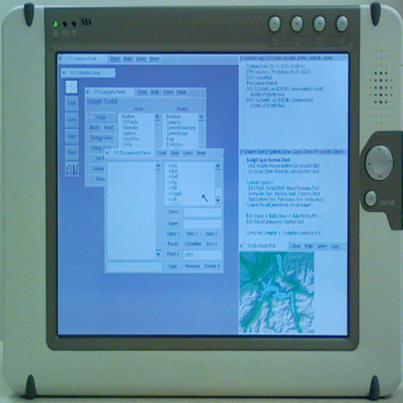

# Oberon RISC Emulator

### Description

An emulator for the Oberon RISC machine.

The Oberon System was designed and implemented in 1990 by professor Niklaus Wirth. It was intended for teaching computer essentials.

### License

ISC

### Icon

### Fanart

Help make me fanart!

### Screenshots

Help make me screenshots!
